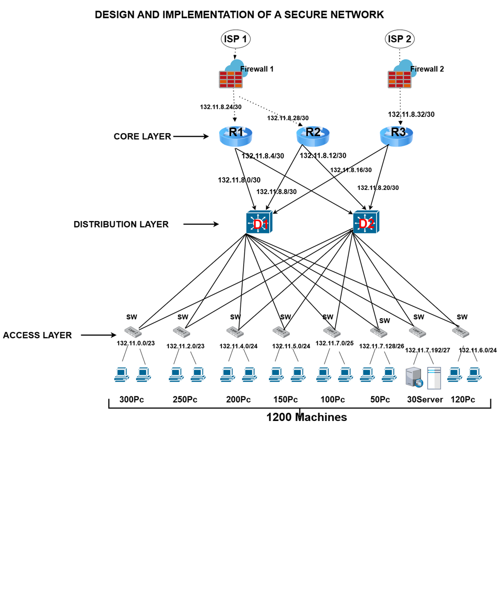
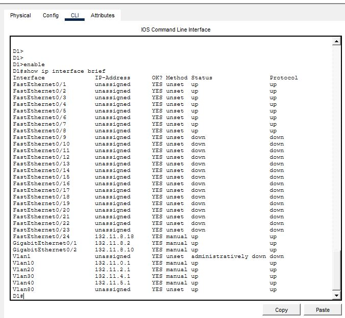
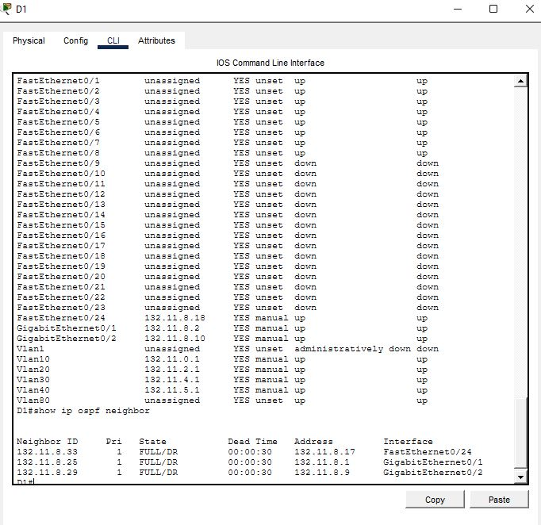

# Design and Implementation of a Secure Enterprise Network

A complete secure network design for a fictional logistics company (Smith Logistics UK) with **1,200 machines across 8 departments**, designed, built, and tested in **Cisco Packet Tracer**.

## Overview

The brief: connect eight departments — from a 300-machine warehouse to a 30-machine server room — with no single point of failure, full departmental segmentation, and security enforced at every layer.

**Key design choices:**
- **Three-tier hierarchical architecture** (core, distribution, access) for scalability and clear separation of responsibilities
- **Full redundancy** — dual ISPs, three mesh-connected core routers, and dual uplinks from every access switch
- **VLSM subnetting** so each department gets address space sized to actual need
- **Defence-in-depth** — security controls at the physical, data link, network, and management layers

## Network Architecture

| Layer | Devices | Role |
|---|---|---|
| Perimeter | 2× Cisco ASA firewalls, dual ISP links | Ingress/egress filtering, WAN redundancy |
| Core | 3× Cisco 2911 routers (R1–R3) | High-speed routing, mesh redundancy |
| Distribution | 2× Cisco 3560 L3 switches (D1, D2) | Inter-VLAN routing, ACL enforcement |
| Access | 8× Cisco 2960 L2 switches | End-device connectivity, VLAN assignment, port security |

## IP Addressing (VLSM)

Base network: `132.11.0.0`

| Department | Hosts | Subnet | Mask |
|---|---|---|---|
| Warehouse | 300 | 132.11.0.0 | /23 |
| Transport | 250 | 132.11.2.0 | /23 |
| Admin | 200 | 132.11.4.0 | /24 |
| Customer Service | 150 | 132.11.5.0 | /24 |
| Guest Wi-Fi | 120 | 132.11.6.0 | /24 |
| IT | 100 | 132.11.7.0 | /25 |
| Management | 50 | 132.11.7.128 | /26 |
| Servers | 30 | 132.11.7.192 | /27 |

Router-to-switch and router-to-firewall links use /30 point-to-point subnets from `132.11.8.0`.

## Routing

- **OSPF (Area 0)** across the core and distribution layers — automatic route discovery and sub-second failover if a core router goes down
- Static default routes from core routers to the firewalls
- Inter-VLAN routing performed in hardware on the Layer 3 distribution switches

## Security Features

| Layer | Control |
|---|---|
| Physical | All unused switch ports administratively shut down |
| Data Link | Port security (max 2 MAC addresses per port, violation shutdown); consistent native VLAN to prevent VLAN hopping |
| Network | Extended ACLs enforcing **two-way guest Wi-Fi isolation** — guests reach the internet and nothing else; internal traffic cannot reach the guest VLAN |
| Management | SSH-only remote access, encrypted passwords, login banners |
| Perimeter | Dual firewalls; server VLAN operates as a DMZ to prevent lateral movement |

### Guest Wi-Fi Isolation

The guest network lives in its own VLAN (VLAN 80) with two ACLs on its gateway interface:
- `BLOCK-GUEST` (inbound) — permits guest traffic to ISP addresses only, denies all internal subnets
- `BLOCK-TO-GUEST` (outbound) — denies all internal traffic destined for the guest subnet

A key lesson from this build: **ACL placement matters as much as the rule itself.** The ACLs must sit on the switch that owns the VLAN's gateway — a control outside the traffic path is no control at all.

## Services

- **DHCP & DNS** — Server 1 (VLAN 70) handles addressing for all departments and internal name resolution
- **Web server** — Server 2 hosts the intranet (HTTP), reachable by internal PCs and blocked for guests via ACL

## Verification

Screenshots in [`/images`](images) show the network converged and operational:

**VLAN gateway interfaces up on D1** (`show ip interface brief`):

**OSPF adjacencies in FULL/DR state across all uplinks** (`show ip ospf neighbor`):

## Known Limitations

**ISP / internet simulation:** The two ISP routers in this project are placeholders representing external connectivity — Packet Tracer cannot simulate a real internet. This means outbound "internet" traffic (e.g. guest Wi-Fi browsing) cannot be fully tested end-to-end inside the file, and pings destined beyond the ISP routers will not receive replies. The design intent still holds and is verifiable at the boundary: the guest ACL permits traffic toward the ISP addresses and denies everything internal, which can be confirmed with `show access-lists` match counters on D2. In a real deployment, the ISP links would terminate at provider equipment with NAT configured at the firewalls.

## How to Open

1. Install [Cisco Packet Tracer](https://www.netacad.com/courses/packet-tracer) (free with a Networking Academy account)
2. Clone this repo and open `network.pkt`
3. Device configs are in [`/configs`](configs)

## What I Learned

- Redundancy is a question you ask at every layer: *what happens when this fails?*
- Security is a per-layer decision, not a bolt-on — defence-in-depth in practice
- Where you place a control matters as much as the control itself
- Working the subnetting out by hand before touching a single device saves hours of debugging later

---

*Built as part of my cybersecurity studies. Feedback and questions are welcome — feel free to open an issue or connect with me on www.linkedin.com/in/kehinde-oyekunle-081045227.*